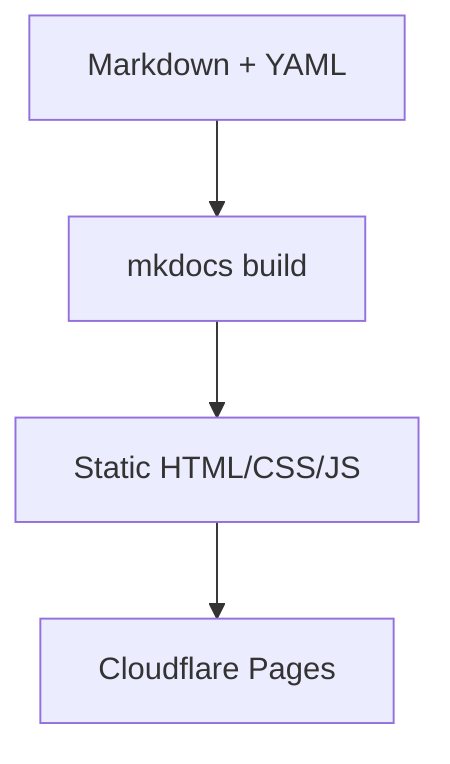

# MkDocs-Material Toolchain



## 1  Local dev

```bash
pip install mkdocs-material
mkdocs serve            # live reload
```

Open <http://127.0.0.1:8000>.

## 2  CI deploy (GitHub Actions)

```yaml
# .github/workflows/ci.yml
name: docs
on:
  push:
    branches: [main]
jobs:
  build:
    runs-on: ubuntu-latest
    steps:
      - uses: actions/checkout@v4
      - run: pipx install mkdocs-material
      - run: mkdocs build --strict
      - uses: cloudflare/pages-action@v1
        with:
          apiToken: ${{ secrets.CF_API_TOKEN }}
          accountId: ${{ secrets.CF_ACCOUNT_ID }}
          projectName: dc-mall-docs
          directory: site
```

## 3  Customising
* Extra CSS → `docs/css/`  
* Template overrides → `overrides/`  
* Nav order → `mkdocs.yml → nav:`

## 4  Common gotchas
| Symptom              | Fix                              |
|----------------------|----------------------------------|
| Page missing         | Add to `nav:`                    |
| Mermaid plain text   | Fence must be ```mermaid         |
| “ℹ︎” badge won’t change | Check `status:` CSS override |


## 5  Guidance on slide decs and other binary file types

Binary slide decks are valuable but don’t belong inside the Markdown repo.
Link to them, store immutable PDF snapshots for audits, and document the convention in your Meta / Doc Standards area so every contributor knows the guard-rails.

### Where slide decks fit in a “docs-as-code” world
| Question                                                            | Recommended approach                                                                                                             | Rationale                                                                                                                                                                                                       |
| ------------------------------------------------------------------- | -------------------------------------------------------------------------------------------------------------------------------- | --------------------------------------------------------------------------------------------------------------------------------------------------------------------------------------------------------------- |
| **Should I commit *.pptx / Google Slides* into the Markdown repo?** | **Usually no.** Keep binaries in their native tool (Google Drive) and link to *version-locked* exports (PDF) from the docs site. | • Git diffs on binaries are useless and bloat the repo.<br>• Authors lose speaker-notes, animations, comments if you force a Markdown export.<br>• CI/CD times explode once media-heavy PPTXs land in the repo. |
| **Do slide decks belong in the engineering KB at all?**             | **Yes—but as *artifacts referenced***, not first-class, version-controlled Markdown pages.                                       | • Exec reviews, quarterly architecture reviews, and audit evidence often live in decks.<br>• Linking them keeps the knowledge graph intact without polluting the textual KB.                                    |


### Special cases & exceptions

| Scenario                                   | Treat decks as …                                      | Tooling tip                                                                                  |
| ------------------------------------------ | ----------------------------------------------------- | -------------------------------------------------------------------------------------------- |
| **Training courses** that evolve like code | Source files in Git **plus** rendered PDF             | Use `git-lfs` for large media; build slides with Reveal.js or Marp so diffs stay text-based. |
| **One-slide runbook diagrams**             | Export as **SVG/PNG** and embed in Markdown           | Text-friendly, diff-able, searchable.                                                        |
| **Regulatory evidence** (SOC 2, ISO)       | PDF snapshot stored **alongside compliance workbook** | Front-matter field `control_refs:` links slide to control ID.                                |

