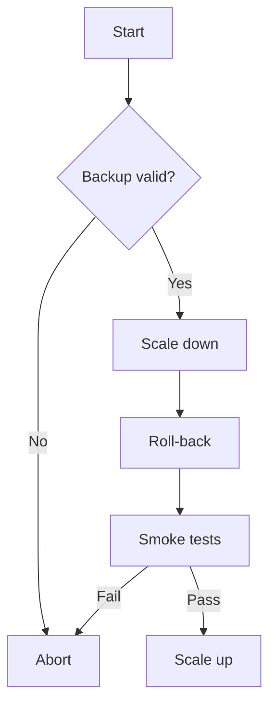

!!! danger "Expect up to 20 min downtime"
    Roll-back pauses **api-cluster-1** traffic during DB migration.

# 1  Purpose
Controlled, auditable process to revert a faulty production patch.

# 2  Pre-conditions
* PagerDuty incident open  
* Backup < 24 h old  
* Change window approved

# 3  Procedure

=== "CLI"
```bash
kubectl scale deploy api-write --replicas 0
kubectl rollout undo deploy api --to-revision=1337
```

=== "Terraform"
```hcl
module "api" {
  source  = "git::ssh://github.com/dc-mall/api.git"
  version = "1.3.7"
}
```



<details>
<summary>Multi-AZ edge case</summary>

* Restore snapshot `rds-prod-rollback` in *az-b*.  
* Point API to new endpoint.
</details>

# 4  Verification
* `/healthz` returns **200** for 5 min  
* Grafana *API P95* < 150 ms

# 5  Post actions
1. Open PIR within 24 h  
2. Schedule fix in next release

# 6  References
* ADR-0043 Adopt Blue/Green Deployments  
* SOP-007 Hot-Fix Process  
* JIRA INC-2819
