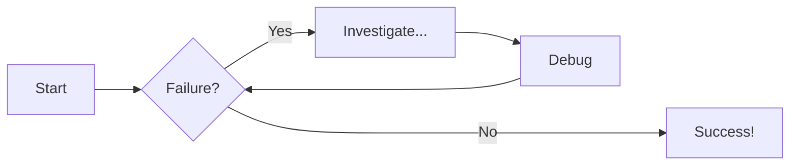
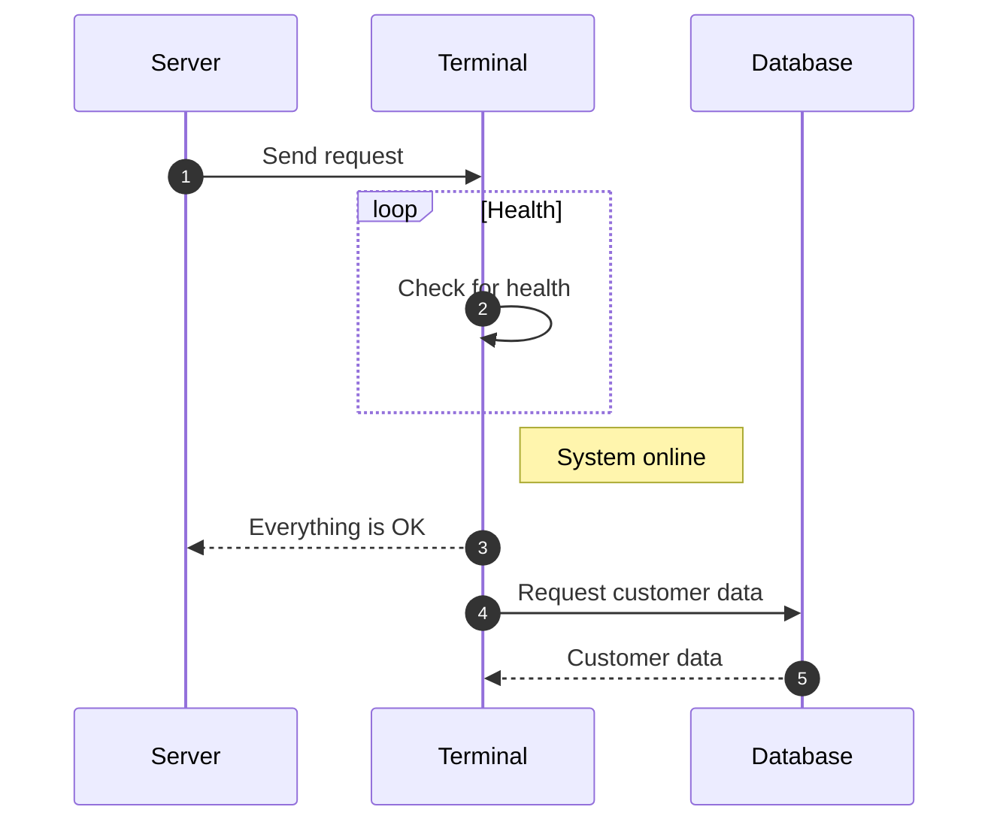

A showcase of every feature: YAML, admonitions, Mermaid diagram, tabs, collapsible details.

Sections:

## Front-matter block – includes status: draft to demo status badge
```yaml
---
title: "<REPLACE-ME>"
owner: "<team-or-person>@dc-mall.com"
status: approved | draft
last_reviewed: YYYY-MM-DD
next_review_due: YYYY-MM-DD      # +6 months is typical
tags: [<comma-separated-list>]
---
```

## Admonition examples
!!! note "Title of the callout"

    Lorem ipsum dolor sit amet, consectetur adipiscing elit. Nulla et euismod
    nulla. Curabitur feugiat, tortor non consequat finibus, justo purus auctor
    massa, nec semper lorem quam in massa nuts.

!!! danger "Title of the callout"

    Lorem ipsum dolor sit amet, consectetur adipiscing elit. Nulla et euismod
    nulla. Curabitur feugiat, tortor non consequat finibus, justo purus auctor
    massa, nec semper lorem quam in massa nuts.

## Code block
```py title="add_numbers.py" linenums="1" hl_lines="2-4"
# Function to add two numbers
def add_two_numbers(num1, num2):
    return num1 + num2

# Example usage
result = add_two_numbers(5, 3)
print('The sum is:', result)
```

## Code Blocks in Content Tabs

=== "Python"

    ```py
    def main():
        print("Hello world!")

    if __name__ == "__main__":
        main()
    ```

=== "JavaScript"

    ```js
    function main() {
        console.log("Hello world!");
    }

    main();
    ```


## Diagram Examples

### Flowcharts


### Sequence Diagrams



## Draw.io diagram embed with link to .drawio source